# 0S JUCKFRUIT : Multi-Container Runtime with Kernel Memory Monitor

##  Project Overview

This project implements a lightweight Linux container runtime in C, along with a kernel-space memory monitoring module. The system is designed to simulate core containerization concepts such as process isolation, resource control, and concurrent execution, while providing a practical understanding of operating system internals.

The project consists of two main components:

1. **User-Space Runtime and Supervisor (`engine.c`)**
   A long-running supervisor process that manages multiple containers concurrently. It is responsible for:

   * Creating isolated containers using Linux namespaces (PID, UTS, and mount)
   * Managing container lifecycle (start, stop, run, and status tracking)
   * Handling CLI commands via an IPC mechanism
   * Capturing container output through a bounded-buffer logging system using producer-consumer synchronization

2. **Kernel-Space Memory Monitor (`monitor.c`)**
   A Linux Kernel Module (LKM) that monitors memory usage of container processes. It:

   * Tracks registered container PIDs using a kernel linked list
   * Periodically checks Resident Set Size (RSS)
   * Enforces memory policies:

     * **Soft limit** → logs a warning when exceeded
     * **Hard limit** → terminates the container process
   * Communicates with user-space via `ioctl`

Additionally, the runtime is used to perform controlled experiments on Linux scheduling behavior by running concurrent workloads with different priorities and analyzing their execution characteristics.

Overall, this project demonstrates key operating system concepts including process isolation, inter-process communication, synchronization, memory management, and scheduling.

---

 
##  1. Team Information

* T Mohammed Saif  ===> [PES1UG24CS636]

---

##  2. Build, Load, and Run Instructions

###  Environment Setup

```bash
sudo apt update
sudo apt install -y build-essential linux-headers-$(uname -r)
```

---

###  Build Project

```bash
cd boilerplate/
make clean
make
```

---

###  Prepare Root Filesystem

```bash
mkdir -p rootfs
wget https://dl-cdn.alpinelinux.org/alpine/v3.20/releases/x86_64/alpine-minirootfs-3.20.3-x86_64.tar.gz
tar -xzf alpine-minirootfs-3.20.3-x86_64.tar.gz -C rootfs
rm alpine-minirootfs-3.20.3-x86_64.tar.gz
mkdir -p logs
```

---

###  Load Kernel Module

```bash
sudo insmod monitor.ko
ls -l /dev/container_monitor
```

---

###  Start Supervisor

```bash
sudo ./engine supervisor ./rootfs
```

---

###  Run Containers

```bash
sudo ./engine start alpha ./rootfs "sleep 30"
sudo ./engine start beta ./rootfs "sleep 30"
```

---

###  Check Containers

```bash
sudo ./engine ps
```

---

###  View Logs

```bash
sudo ./engine logs alpha
```

---

###  Stop Container

```bash
sudo ./engine stop alpha
```

---

###  Cleanup

```bash
sudo rmmod monitor
make clean
```

---

##  3. Demo with Screenshots

---

###  Screenshot 1 — Multi-container supervision

Two containers (`alpha`, `beta`) running simultaneously under a single supervisor.

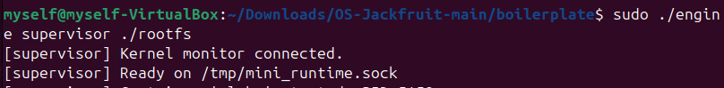
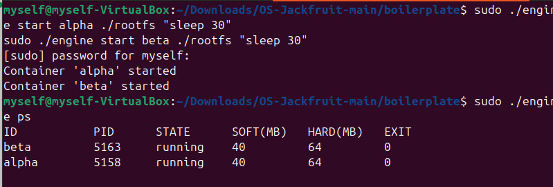

---

###  Screenshot 2 — Metadata tracking

Output of:

```bash
sudo ./engine ps
```

Showing container ID, PID, and state.


---

###  Screenshot 3 — Bounded-buffer logging

Commands:

```bash
sudo ./engine start alpha ./rootfs "/bin/sh -c 'echo Alpha is running... && sleep 5'"
sudo ./engine logs alpha
```

Shows logs stored via producer-consumer pipeline.

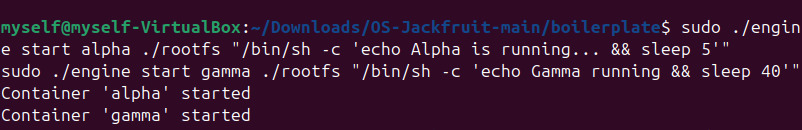
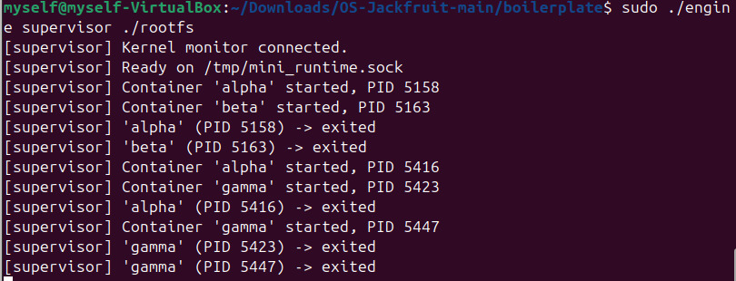

---

###  Screenshot 4 — CLI and IPC

Command:

```bash
sudo ./engine stop gamma
```

Shows CLI interacting with supervisor through IPC.

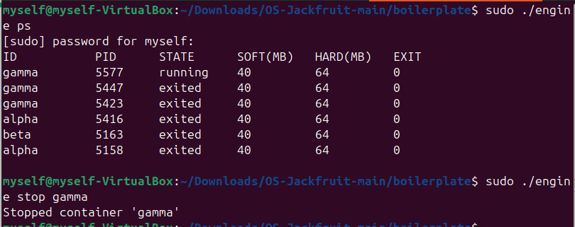
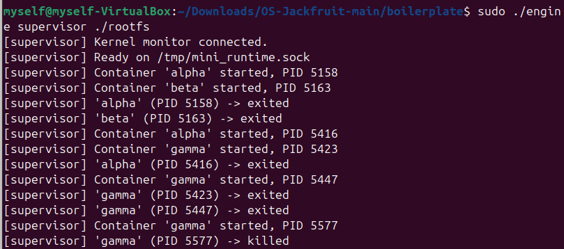

---

###  Screenshot 5 — Soft-limit warning

Commands:

```bash
cp memory_hog rootfs/
sudo ./engine start memtest ./rootfs /memory_hog --soft-mib 20 --hard-mib 40
sudo dmesg | grep container_monitor
```

Shows soft limit warning.

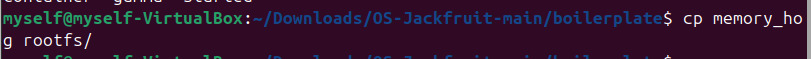
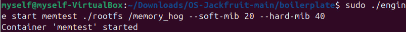\
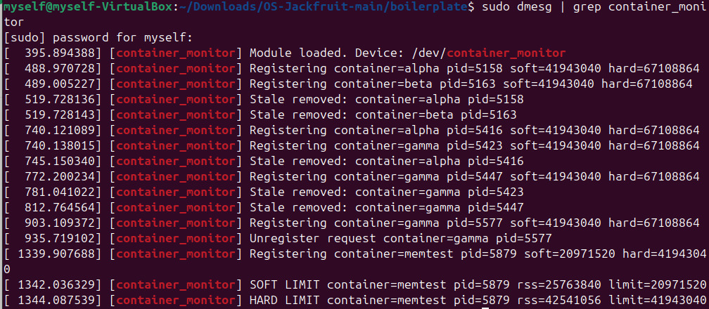

---

###  Screenshot 6 — Hard-limit enforcement

Shows kernel killing container after exceeding hard limit.

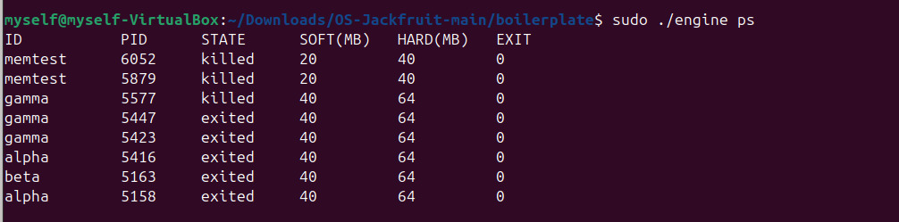

---

###  Screenshot 7 — Scheduling experiment

Commands:

```bash
cp cpu_hog rootfs/
cp io_pulse rootfs/

sudo ./engine start cpu-high ./rootfs "/cpu_hog 30" --nice -10
sudo ./engine start cpu-low ./rootfs "/cpu_hog 30" --nice 10
```

Compare logs:

```bash
sudo ./engine logs cpu-high
sudo ./engine logs cpu-low
```

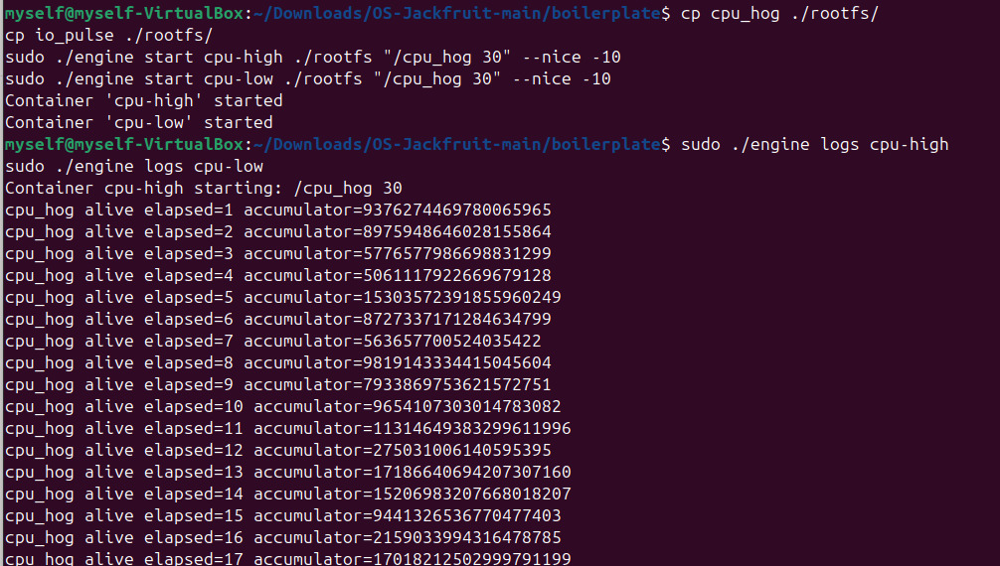
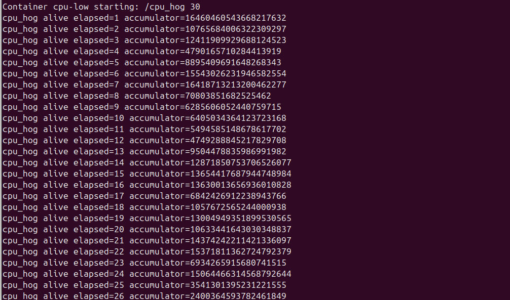
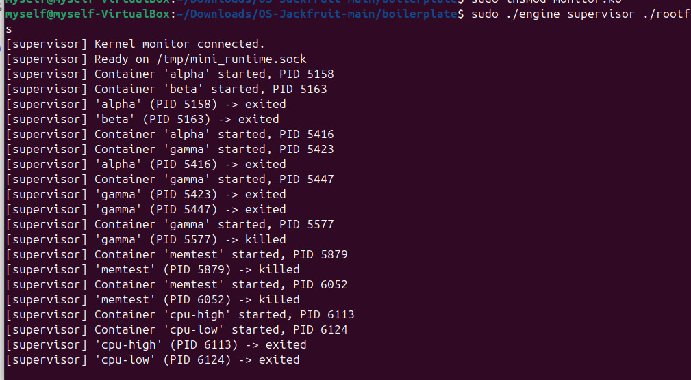

---

###  Screenshot 8 — Clean teardown

Commands:

```bash
sudo rmmod monitor
ps aux | grep -E 'Z|defunct'
```

Shows no zombie processes.

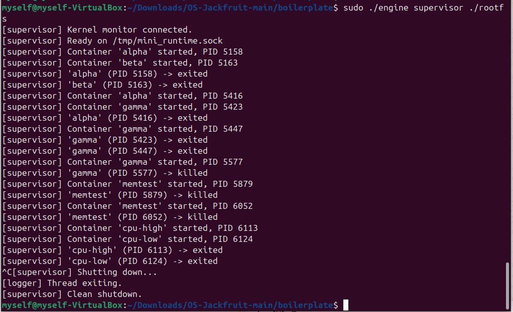
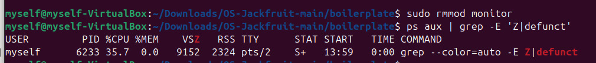
---

##  4. Engineering Analysis

### 🔹 Isolation Mechanisms

Containers are isolated using:

* PID namespace (separate process trees)
* UTS namespace (hostname isolation)
* Mount namespace (filesystem isolation)
* `chroot()` to restrict filesystem access

However, all containers share the same host kernel.

---

### 🔹 Supervisor and Process Lifecycle

* Supervisor is a long-running parent process
* Uses `clone()` to create containers
* Tracks metadata (PID, state, logs)
* Uses `SIGCHLD` to reap child processes
* Prevents zombie processes

---

### 🔹 IPC, Threads, and Synchronization

Two IPC mechanisms:

1. **Logging (pipes)**

   * Container → supervisor
2. **Control (CLI → supervisor)**

Bounded buffer uses:

* `pthread_mutex`
* `pthread_cond`

Prevents:

* Race conditions
* Data corruption
* Deadlocks

---

### 🔹 Memory Management and Enforcement

* RSS measures actual physical memory usage
* Soft limit → warning only
* Hard limit → process killed

Kernel module enforces limits because:

* User space cannot reliably monitor memory
* Kernel has direct access to process memory

---

### 🔹 Scheduling Behavior

* CPU-bound processes compete for CPU
* Nice values affect scheduling priority
* High priority → faster execution
* Low priority → slower execution

---

##  5. Design Decisions and Tradeoffs

| Component      | Choice         | Tradeoff                    | Justification          |
| -------------- | -------------- | --------------------------- | ---------------------- |
| Isolation      | chroot         | Less secure than pivot_root | Simpler implementation |
| IPC            | UNIX socket    | Slight complexity           | Reliable communication |
| Logging        | Bounded buffer | Requires synchronization    | Prevents data loss     |
| Kernel monitor | LKM            | Needs root access           | Accurate enforcement   |

---

##  6. Scheduler Experiment Results

### Experiment

```bash
sudo ./engine start cpu-high ./rootfs "/cpu_hog 30" --nice -10
sudo ./engine start cpu-low ./rootfs "/cpu_hog 30" --nice 10
```


---

### Observations

| Container | Priority | Behavior         |
| --------- | -------- | ---------------- |
| cpu-high  | High     | Faster execution |
| cpu-low   | Low      | Slower execution |

---

### Conclusion

Linux scheduler:

* Allocates CPU based on priority
* Maintains fairness
* Improves responsiveness

---

##  Final Conclusion

This project demonstrates:

* Container isolation using namespaces
* Kernel-user interaction via ioctl
* Memory enforcement with soft & hard limits
* Concurrent logging using producer-consumer model
* Real-world scheduling behavior

---

##  End of Project
